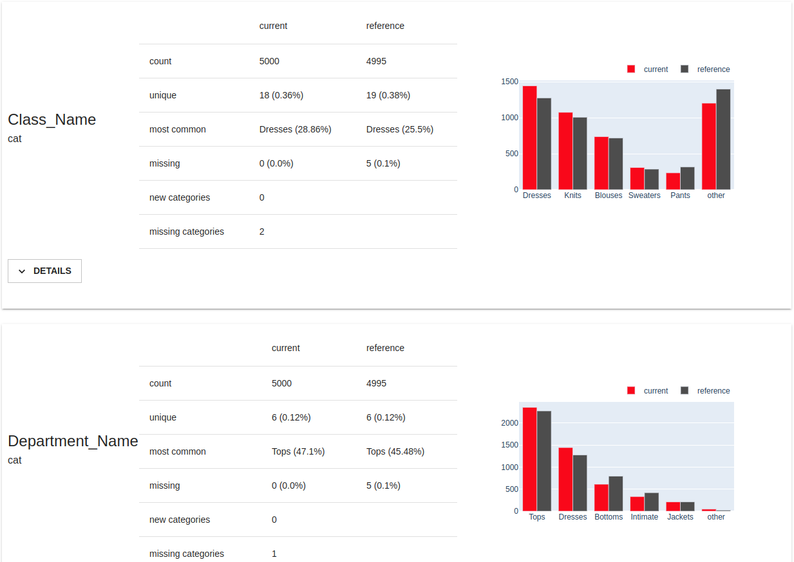
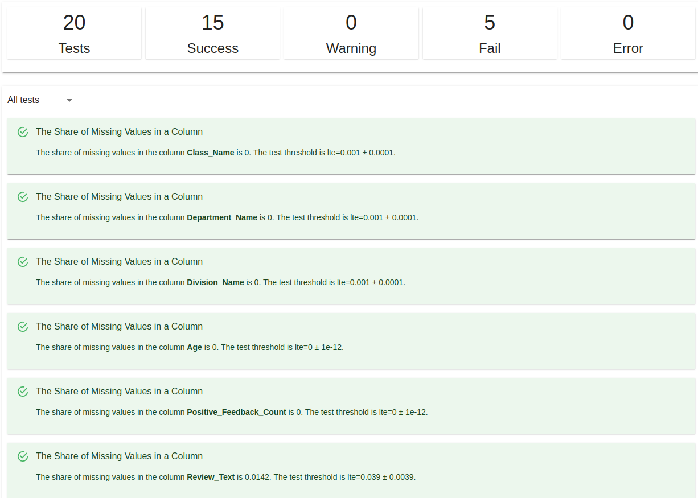

# 🏎 Explore Data Profiling and Validation with Evidently
Data profiling and validation is the process of examining and analyzing data to understand its characteristics, patterns, and quality. The goal of this process is to gain insight into the data, identify potential issues or errors, and ensure that the data is fit for its intended use.

Evidently is a Python package that provides tools for data profiling and validation. Evidently makes it easy to generate reports on your data, which can provide insights into its distribution, missing values, correlation, and other characteristics. These reports can be visualized and examined to better understand the data and identify any potential issues or errors.

Data validation also involves testing the quality and consistency of the data. This can be done using a variety of techniques, such as checking for missing values, duplicate records, and outliers, as well as testing the consistency and accuracy of the data. Evidently also provides a suite of tests that can be used to evaluate the quality of the data, and provides scores and metrics for each test, as well as an overall data quality score.

## 🗺 Overview
This example uses [`evidently`](https://github.com/evidentlyai/evidently), a
useful open-source library to painlessly check for missing values (among other
features). 

ZenML implements some standard steps that you can use to get reports or test your
data for quality and other purposes. These steps are:

* `EvidentlyReportStep` and `EvidentlySingleDatasetReportStep`: These steps generate
a report for one or two given datasets. Similar to how you configure an Evidently
Report, you can configure a list of metrics, metric presets or metrics generators
for the step as parameters. Instantiating these steps is done through the `zenml.integrations.evidently.steps.evidently_report_step` helper function. The full list of metrics can be found
[here](https://docs.evidentlyai.com/reference/all-metrics/).

* `EvidentlyTestStep` and `EvidentlySingleDatasetTestStep`: These step test one
or two given datasets using various Evidently tests. Similar to how you configure
an Evidently TestSuite, you can configure a list of tests, a test presets or
test generators for the step as parameters. Instantiating these steps is done through the `zenml.integrations.evidently.steps.evidently_test_step` helper function. The full list of tests can be found
[here](https://docs.evidentlyai.com/reference/all-tests/).

## 🧰 How the example is implemented
In this example, we compare two separate slices of the same dataset as an easy
way to get an idea for how Evidently is making the comparison between the two
dataframes. We chose the [OpenML Women's E-Commerce Clothing Reviews](https://www.openml.org/search?type=data&status=active&id=43663) text dataset to illustrate how this works.

Here you can see how instantiating and configuring the standard Evidently
report step can be done using our included `evidently_report_step` utility
function:

```python
from zenml.integrations.evidently.metrics import EvidentlyMetricConfig
from zenml.integrations.evidently.steps import (
    EvidentlyColumnMapping,
    EvidentlyReportParameters,
    evidently_report_step,
)

text_data_report = evidently_report_step(
    step_name="text_data_report",
    params=EvidentlyReportParameters(
        column_mapping=EvidentlyColumnMapping(
            target="Rating",
            numerical_features=["Age", "Positive_Feedback_Count"],
            categorical_features=[
                "Division_Name",
                "Department_Name",
                "Class_Name",
            ],
            text_features=["Review_Text", "Title"],
        ),
        metrics=[
            EvidentlyMetricConfig.metric("DataQualityPreset"),
            EvidentlyMetricConfig.metric(
                "TextOverviewPreset", column_name="Review_Text"
            ),
            EvidentlyMetricConfig.metric_generator(
                "ColumnRegExpMetric",
                columns=["Review_Text", "Title"],
                reg_exp=r"[A-Z][A-Za-z0-9 ]*",
            ),
        ],
        # We need to download the NLTK data for the TextOverviewPreset
        download_nltk_data=True,
    ),
)
```

For more information on what these configuration parameters mean, please refer
to [the ZenML Evidently Data Validator documentation](https://docs.zenml.io/component-gallery/data-validators/evidently#the-evidently-report-step).

The same goes for the test step:

```python
from zenml.integrations.evidently.steps import (
    EvidentlyColumnMapping,
    EvidentlyTestParameters,
    evidently_test_step,
)
from zenml.integrations.evidently.tests import EvidentlyTestConfig


text_data_test = evidently_test_step(
    step_name="text_data_test",
    params=EvidentlyTestParameters(
        column_mapping=EvidentlyColumnMapping(
            target="Rating",
            numerical_features=["Age", "Positive_Feedback_Count"],
            categorical_features=[
                "Division_Name",
                "Department_Name",
                "Class_Name",
            ],
            text_features=["Review_Text", "Title"],
        ),
        tests=[
            EvidentlyTestConfig.test("DataQualityTestPreset"),
            EvidentlyTestConfig.test_generator(
                "TestColumnRegExp",
                columns=["Review_Text", "Title"],
                reg_exp="^[0..9]",
            ),
        ],
        # We need to download the NLTK data for the TestColumnRegExp test
        download_nltk_data=True,
    ),
)
```

For more information on what these configuration parameters mean, please refer
to [the ZenML Evidently Data Validator documentation](https://docs.zenml.io/component-gallery/data-validators/evidently#the-evidently-test-step).

These steps are then used in a simple ZenML pipeline that loads the data from
OpenML, splits it into two slices, and then feeds the slices into these two
Evidently steps:

```python
@pipeline(enable_cache=False, settings={"docker": docker_settings})
def text_data_report_test_pipeline(
    data_loader,
    data_splitter,
    text_report,
    text_test,
    text_analyzer,
):
    """Links all the steps together in a pipeline."""
    data = data_loader()
    reference_dataset, comparison_dataset = data_splitter(data)
    report, _ = text_report(
        reference_dataset=reference_dataset,
        comparison_dataset=comparison_dataset,
    )
    test_report, _ = text_test(
        reference_dataset=reference_dataset,
        comparison_dataset=comparison_dataset,
    )
    text_analyzer(report)
```

In the post-execution phase, after the pipeline runs, we use the ZenML Evidently
visualizer to display data report and test results in your browser or within a
Jupyter notebook:




# ☁️ Run in Colab
If you have a Google account, you can get started directly with Google colab 
[](https://colab.research.google.com/github/zenml-io/zenml/blob/main/examples/evidently_data_validation/evidently.ipynb)

# 🖥 Run it locally

## 👣 Step-by-Step
### 📄 Prerequisites 
In order to run this example, you need to install and initialize ZenML:

```shell
# install CLI
pip install "zenml[server]"

# install ZenML integrations and example dependencies
zenml integration install evidently sklearn -y
pip install nltk

# pull example
zenml example pull evidently_data_validation
cd zenml_examples/evidently_data_validation

# Initialize ZenML repo
zenml init

# Start the ZenServer to enable dashboard access
zenml up
```

### 🥞 Set up your stack for Evidently

You need to have an Evidently Data Validator component to your stack to be able
to use Evidently data profiling in your ZenML pipelines. Creating such a stack 
is easily accomplished:

```shell
zenml data-validator register evidently -f evidently
zenml stack register evidently_stack -o default -a default -dv evidently --set
```

### ▶️ Run the Code
Now we're ready. Execute:

```bash
python run.py
```

### 🧽 Clean up
In order to clean up, delete the remaining ZenML references.

```shell
rm -rf zenml_examples
```
